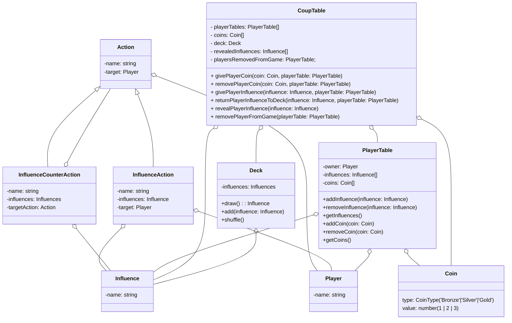

```mermaid

classDiagram
    class Player{
      -name: string
    }

    class Influence{
      -name: string
    }

    class Action{
      -name: string
      -target: Player
    }

    class InfluenceAction {
      -name: string
      -influences: Influence
      -target: Player
    }

    class InfluenceCounterAction{
      -name: string
      -influences: Influences
      -targetAction: Action
    }

    class Coin{
      type: CoinType ('Bronze'|'Silver'|'Gold')
      value: number (1 | 2 | 3)
    }

    class PlayerTable {
      -owner: Player
      -influences: Influence[]
      -coins: Coin[]

      +addInfluence(influence: Influence)
      +removeInfluence(influence: Influence)
      +getInfluences()
      +addCoin(coin: Coin)
      +removeCoin(coin: Coin)
      +getCoins()
    }

    class CoupTable {
      - playerTables: PlayerTable[]
      - coins: Coin[]
      - deck: Deck
      - revealedInfluences: Influence[]
      - playersRemovedFromGame: PlayerTable;

      + givePlayerCoin(coin: Coin, playerTable: PlayerTable)
      + removePlayerCoin(coin: Coin, playerTable: PlayerTable)
      + givePlayerInfluence(influence: Influence, playerTable: PlayerTable)
      + returnPlayerInfluenceToDeck(influence: Influence, playerTable: PlayerTable)
      + revealPlayerInfluence(influence: Influence)
      + removePlayerFromGame(playerTable: PlayerTable)
    }

    class Deck {
      -influences: Influences

      +draw(): Influence
      +add(influence: Influence)
      +shuffle()
    }

    Action <|-- InfluenceCounterAction
    Action <|-- InfluenceAction
    Action o-- Player
    
    InfluenceAction  o-- Influence
    InfluenceAction o-- Player

    InfluenceCounterAction o-- Influence
    InfluenceCounterAction o-- Action

    PlayerTable o-- Influence  
    PlayerTable o-- Coin
    PlayerTable o-- Player

    CoupTable o-- PlayerTable
    CoupTable o-- Coin
    CoupTable o-- Deck
    CoupTable o-- Influence
    
    Deck o-- Influence
```
